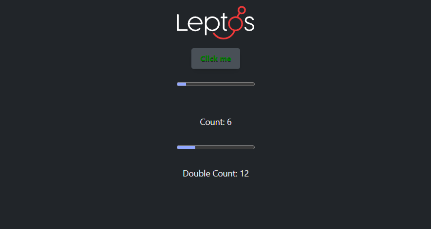
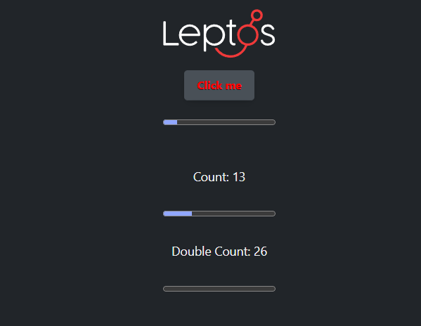
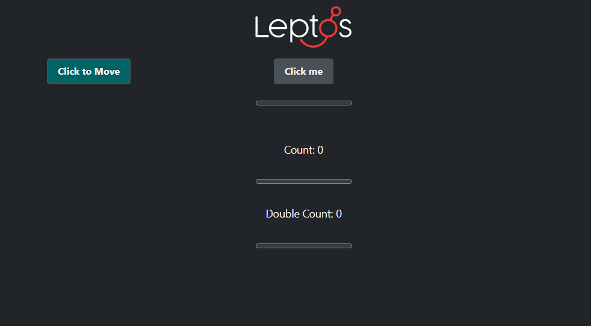
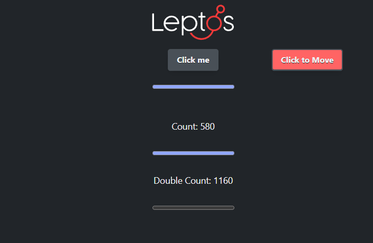
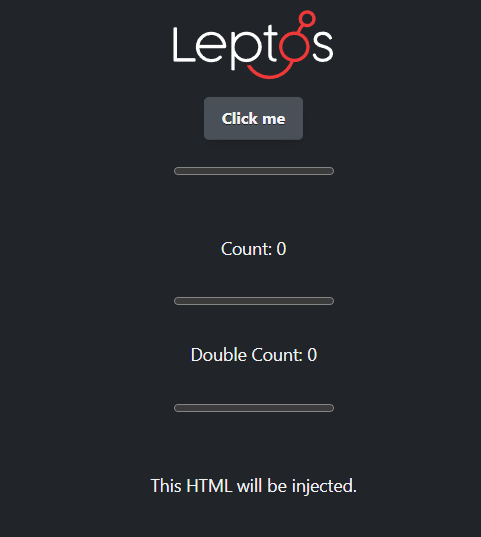
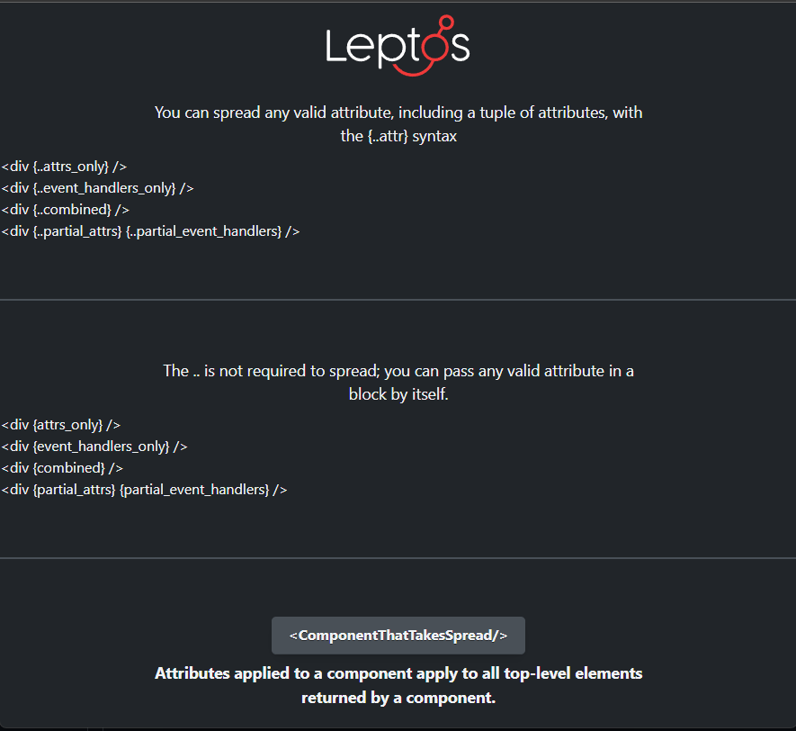
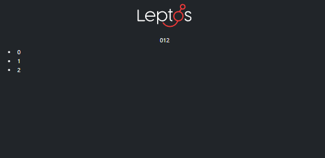
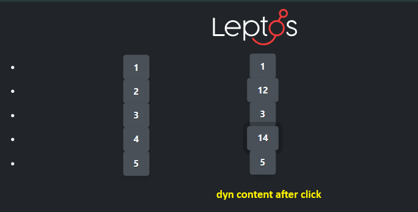
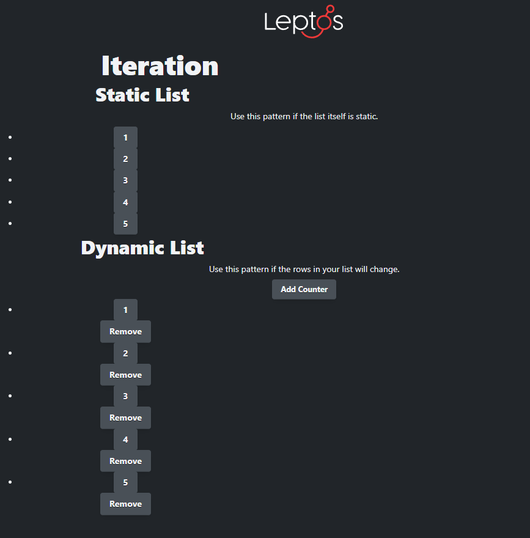
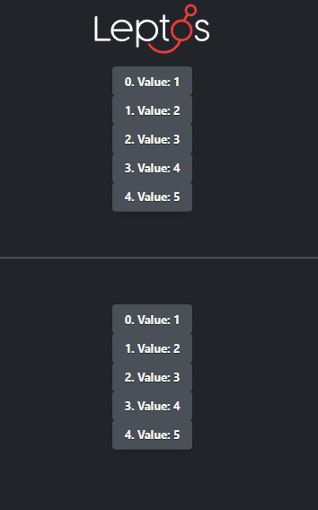

# leptos-tutorial
- https://github.com/implrust/leptos-tutorial

# environment setup commands
- cargo install trunk
- rustup target add wasm32-unknown-unknown
- cargo install leptosfmt

# vscode plugins
- leptos-fmt
- leptos-vscode

# project setup
- cargo init leptos-tutorial
- cargo add leptos --features=csr
- cargo add console_error_panic_hook

# project run commands
- trunk serve open
- trunk serve --port 3000 --open

# leptos csr starter template
- https://github.com/leptos-rs/start-trunk

# cargo commands
- cargo --list

# content
- 3.1 A Basic Component ✅
    - signals 
    - ReadSignal, WriteSignal, RWSignal, 
    - .get(), .set(), .with(), .update(), .get_untracked()

  

    

- 3.2 Dynamic Attributes ✅
    - trunk.toml
    - dynamic attributes, styles
    - set css variables for stylesheet
    - derived signals
    - injecting raw html

  

     

  

 

  

 

  

 

- 3.3 Components and Props
    - components
    - props: optional, default,
    - passing value to components 
        - via props (signals, functions)
    - into props, optional generic props
    - documenting components
    - spread attr ref: https://github.com/leptos-rs/leptos/blob/main/examples/spread/src/lib.rs

  

    

- 3.4 Iteration
<h5>3.4.1 a Static Views - Static Content</h5>

  

    
<h5>3.4.1 b Static Views - Dynamic Content</h5>

  

    
<h5>3.4.2 Static List (Dynamic Content) - Dynamic List (Dynamic Content)</h5>

  

    
<h5>3.4.3 Accessing an index while iterating with ForEnumerate</h5>

  

    